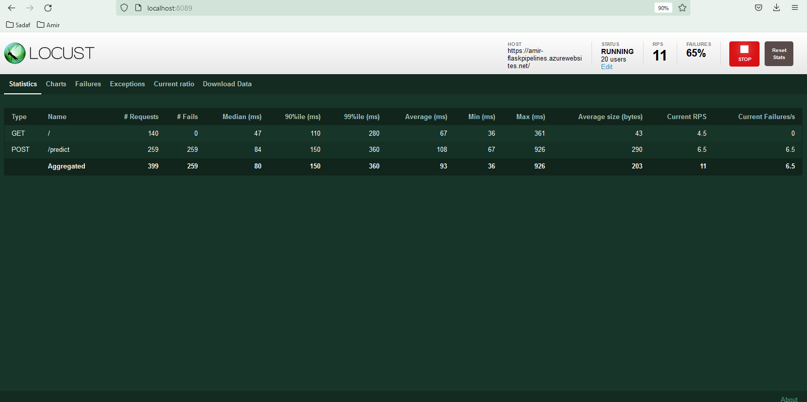

 
# Overview

In this project, you will build a Github repository with a python ML app for prediction of housing prices. A data based ML model is already traiend with data and is available. You have to enable Github actions for CI linting and testing. Aferward you will deploy a flask python app and by using CD in Azure pipeline you will automate the app deployment. 

## Project Plan
In this section you find the project planning and tasks:

* A [Trello](https://trello.com/b/rJP5K6yR/udacityprojekt2) board for the project
* A [spreadsheet](https://github.com/Amirali53/Project2/blob/62553a880ea0e07507fc0ba2a5d7652843b20104/Project2_Planning.xlsx) 


## Instructions
 
- User pushes changes in code
- Github Actions lint and test the changes automatically
- Azure pipeline test the code and deploy it to App service
- App service is continousely updated and tested

## Deploy the app in Azure Cloud Shell

Go to the azure portal in your browser and open the Azure Cloud shell.
You need to connect your Cloud shell to Github by using SSH keys generated once in Cloud shell and set up in the Github account.
After connection established you can clone the git repo by using this command:
```
git@github.com:Amirali53/Project2.git
```

 


After cloning is completed you need to switch to the following directory:
```
cd Project2
```
Now you could run: 
```
make setup
```
to locate python 3 and activate it by:
```
source ~/.Project2/bin/activate
```
Now you can run:
```
make all
```
Running the command above will install the contents of requirement.txt file for python. After Installation the lint and test will follow.
Now you can run the python app for first validation:
 
```
python app.py
```
 
Open a new browser and chang to the Project2 directory. Run the following script:
```
./make_prediction.sh
```
You will see the prediction result:
 


You have to enable Github actions respectively. If it is activated correctly a YAML file will be generated by Github. Each time you change anything in your repo then Github actions will run automatically and check your change:
 


Now it is time to deploy a flask app which is provided. You could change the name of your app accordingly: 
```
az webapp up -l westeurope  -n amir-flaskpipelines -g amir-udacity-rg
```
 

I needed to specify the location of my deployment for cost reasons and subscriptions.
Ater successfull deployment of app you can run the remote prediction. Of course you need to change the app name in the following file before running it:
```
./make_predict_azure_app.sh
```


And now you can check the logs by:
```
az webapp log tail -n amir-flaskpipelines -g amir-udacity-rg
```


In order to set up the Azure pipeline you need to create a new project and a new pipeline in Azure DevOps.
If you have linked the pipeline to your Github project and setup the Python Linux app deployment correctly a YAML file will be generated by Azure and pushed to Github.
By changing anything in the repo the Azure Pipeline will start an automated build and after successfull Build an automated deployment will follow in Azure Pipeline:


## Load Testing by Locust
We can use locust to do a load test against our application. In this example we will do a load test against the app running in azure rather than locally.

Install locust and then run locust on command line:
```
pip install locust
locust
```

Open a browser and go to http://localhost:8089. Enter the total number of users to simulate, spawn rate, set the host to https://amir-flaskpipelines.azurewebsites.net/, and click Start Swarming:



## Enhancements

You could improve the project to use Github Actions instead of Azure

## Demo 

This is the [youtube](https://youtu.be/l_-zKFnGPdQ) link to see a demo (UPDATED!)


